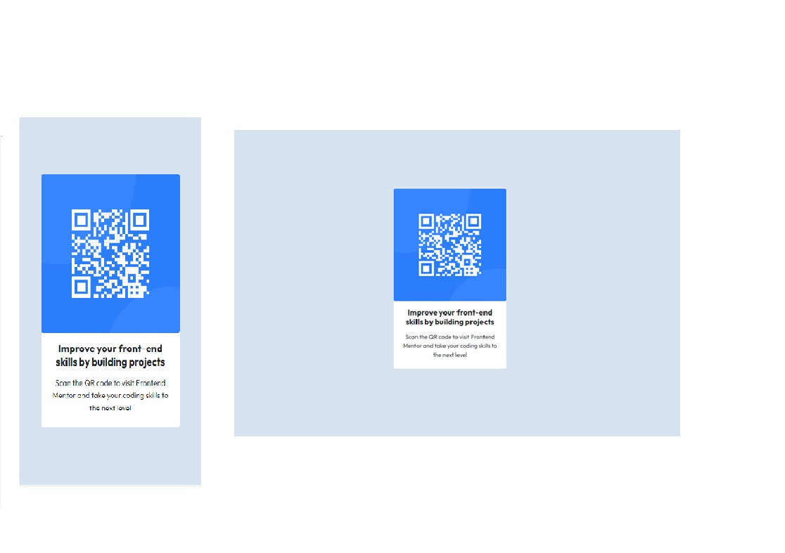

# Frontend Mentor - QR code component solution

This is a solution to the [QR code component challenge on Frontend Mentor](https://www.frontendmentor.io/challenges/qr-code-component-iux_sIO_H). Frontend Mentor challenges help you improve your coding skills by building realistic projects. 

## Table of contents

- [Overview](#overview)
  - [Screenshot](#screenshot)
  - [Links](#links)
- [My process](#my-process)
  - [Built with](#built-with)
  - [What I learned](#what-i-learned)
  - [Continued development](#continued-development)
  - [Useful resources](#useful-resources)
- [Author](#author)
- [Acknowledgments](#acknowledgments)


## Overview

### Screenshot



Add a screenshot of your solution. The easiest way to do this is to use Firefox to view your project, right-click the page and select "Take a Screenshot". You can choose either a full-height screenshot or a cropped one based on how long the page is. If it's very long, it might be best to crop it.

Alternatively, you can use a tool like [FireShot](https://getfireshot.com/) to take the screenshot. FireShot has a free option, so you don't need to purchase it. 

Then crop/optimize/edit your image however you like, add it to your project, and update the file path in the image above.


### Links

- [Solution URL](https://github.com/baijuka/qrcode-compoent)
- [Live Site URL](https://baijuka.github.io/qrcode-compoent/)

## My process

### Built with

- Semantic HTML5 markup
- CSS custom properties
- Flexbox
- CSS Grid
- Mobile-first workflow


### What I learned

Front-end development requires patience and crativity. By developing this site I learned many aspects of web development. I have applied bootstrap framework's various components and style to achieve the desired output.  I have applied diffrent Bootstrap classes like .container, .bg-info, .d-flex .flex-column .min-vh-100 .justify-content-center .align-items-center, card etc. to make the page as expected.

To see how you can add code snippets, see below:

```html
<h1>Some HTML code I'm proud of</h1>
```
```css
.proud-of-this-css {
  color: papayawhip;
}
```
```js
const proudOfThisFunc = () => {
  console.log('🎉')
}
```

```Bootstrap
<div class="container bg-info">
```

### Continued development

I would like to make the site dynamic by adding more content and functionalities.


### Useful resources

- [Bootstrap](https://getbootstrap.com/) - Boostrap is a css framework and this site has helped me applying robust css styles.
- [W3Schools](https://www.w3schools.com) - W3Schools is the first point of reference for every developer. This website has a plethora of tutorials on almost every subjects in front-end and back-end development.  I'd recommend it to anyone still learning this concept.


## Author

- [Baiju Abraham ](https://github.com/baijuka)
- Frontend Mentor - [@baijuka](https://www.frontendmentor.io/profile/yourusername)


## Acknowledgments

Thanks for the Frontend Mentor for offering an opportunity to take part in the coding challenge.

